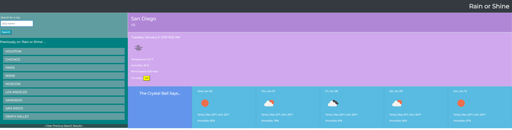

# rain_or_shine

## Introduction

Welcome to my repo for my weather dashboard. This is a web-based weather data accumulator that helps fetch easily glance-able data about any major city by just entering its name. You can see current stats such as temperature and a color coded UV Index as well as a concise 5 day forecast.

## Instructions

- Enter a city name in the Search box to search. (Due to API limitations, not all cities will be available.)
- Click on the color coded UV Index button to open a guide for the color and values of UV Indices.
- Use the city buttons under the "Previously" section to look up a previously searched city.
- Use the 'clear' button to clear all previously searched city buttons and your local storage.

## Preview

## Deployed Link

https://https://wdfhai.github.io/rain_or_shine/

## Special Mention

Thanks to the developers of openweathermap for developing the API that helped me scrape the relevant data needed to this project. Find them at https://openweathermap.org/api.

## Summary

Thanks again for visiting my Weather Dashboard repository. This required knowledge of Javascript, Jquery, Bootstrap as well as a third party API, which in this case was openweathermap. Cheers!
