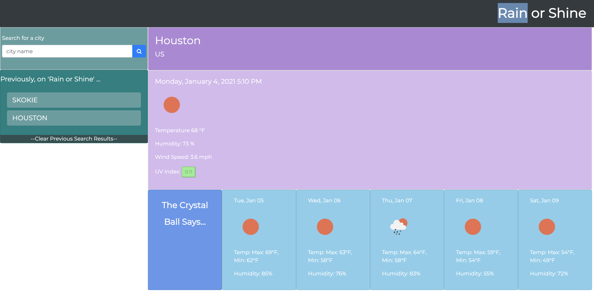

# rain_or_shine

## Introduction

Welcome to my repo for my weather dashboard. This is a web-based weather data accumulator that helps fetch easily glanceable data about any major city by just entering its name.

## Instructions

-
-
-

## Preview

## Deployed Link

https://

## Special Mention

Thanks to the developers of openweathermap for developing the API that helped me scrape the relevant data needed to this project. Find them at https://openweathermap.org/api.

## Summary

Thanks again for visiting my Weather Dashborad repository. This required knowledge of Javascript, Jquery, Bootstrap as well as a third party API, which in this case was openweathermap.Cheers!
